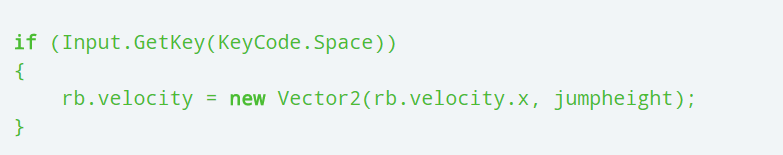
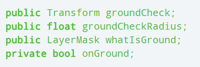
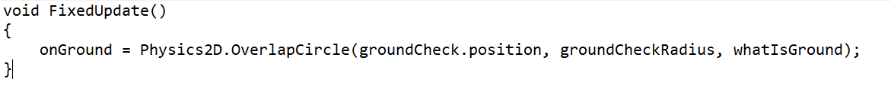
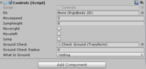
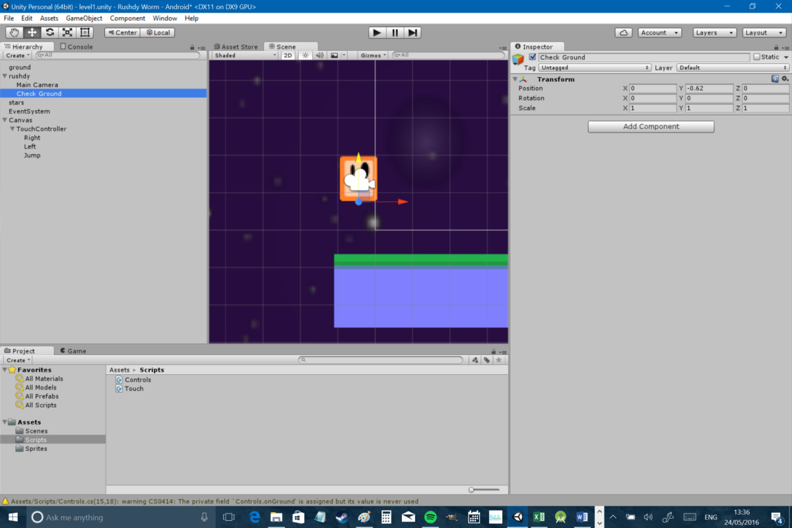
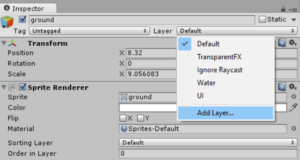
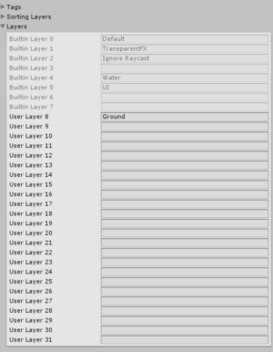
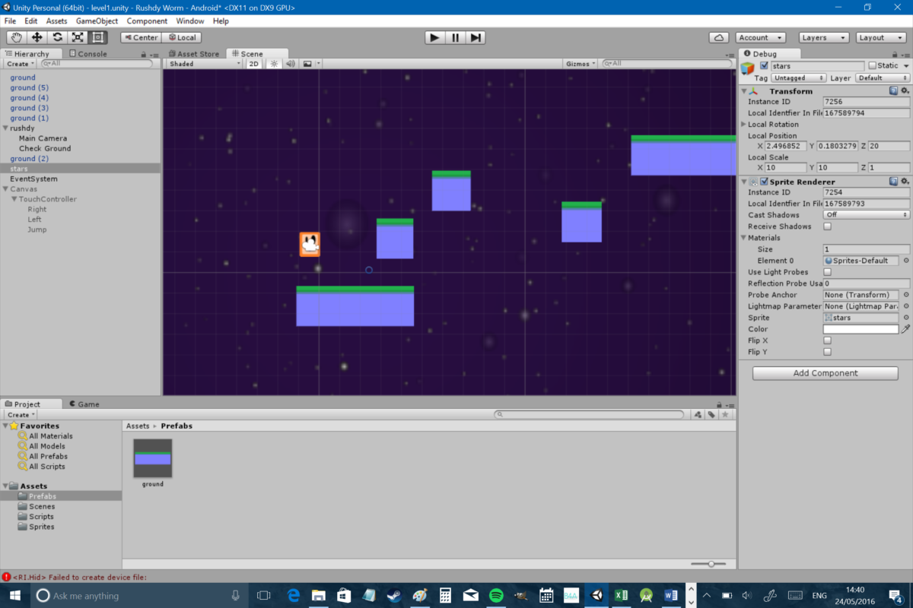

 <h1>Lesson 2</h1>
  <h2>Creating Jumping and fixing bugs</h2>
  
In this tutorial we will be creating the second part of our game.

  <h3>Steps:</h3>
  <ol>
    <li>The first thing I want to do is give our man Rushdy the ability to jump. It’s not much of a platformer until we can do that…  </li>
    <li>First, open up your control script and create a public float called jumpheight. Remember, you can set jumpheight from the inspector in Unity itself (I set it to 8 but you can play around and choose how high you want to jump yourself!). Next, add the
      following bit of code to the same script:
       
      
    </li>
    <li>At this point, you can hit play and test hitting space button to jump. There’s just one problem: you can jump infinitely! Hold down space or keep tapping the jump button and you can sore into the stratosphere… So we need a way to check if our player
      is on the ground and then only let him jump when he is on terra firma.
       One way to do this is with ray casts. However, the easiest method for now is probably to just check whether the point beneath the player is ground or not. To do this, we’ll need to create a new ‘transform’ in our control script. A transform
      is simply a point in space with its own coordinates and rotation. We’ll call this groundCheck and add it the way we add any other variable. We’re also going to give that point a radius, we’re going to define a ‘layer mask’ (I’ll get to that) and
      we’re going to create a boolean called onGround.
       
      
       You also need to add the following lines of code below:
        
        FixedUpdate works very similarly to Update except that Update is tied to the refresh rate of the screen, whereas FixedUpdate has a more predictable behavior that makes it better suited to physics-related code. The lines of code we added here
      simply set the boolean onGround to ‘true’ only when the new circle overlaps with the ‘ground’ layer. But of course we haven’t set the coordinates of the groundCheck transform yet, so to rectify that, go back to Unity and create an empty game object
      as a child of your player (right click on the player object in the hierarchy and select ‘Create Empty’). Call this Check Ground.
       Now if you select your player, you’ll notice you can see that ‘Ground Check’ is currently set to ‘None (Transform)’. Simply drag Check Ground and drop it into that box.
        
       You also need to make sure that you position your new empty object in the right place; so double click on Check Ground in the Hierarchy and then use the move tool to set it just below your player, still slightly overlapping.
        
       You can fiddle with this later. Click on your player again and then be sure to set the radius value to 0.1.
       Okay, we’re nearly there! All that’s left to do is to create your ‘ground’ layer and to do that you just need to select the platform game object and then find the drop down menu called ‘layers’.
        
       Select ‘add layer’ and then enter ‘Ground’ into the first empty box.
        
       Head back to your game object and click on the same menu and you should find that ‘Ground’ is now an option for you to select. You also need to view your player in the Inspector and choose the same layer for whatIsGround (remember, we can see
      public variables in Unity and set them this way). If you’ve done all this correctly, then you can hit play and you should find the player only jumps once. Win!
    </li>
    <li>Your game is now functional enough to actually be fun! You’d just need to add a few more platforms for your own amusement and practice hopping from one to the next… You can just copy and paste your platforms and resize/position them as you please.
      However before you do that we need to talk about prefabs.
       A prefab is what it sounds like: a ‘prefabricated’ asset that has multiple properties attached. If we create a prefab, this then allows us to make global changes by simply editing the properties of the prefab rather than each in-game object
      individually. To do this, simply create a new folder in assets called ‘Prefabs’ (original I know) and then drag your ground object from the Hierarchy and into that folder. Now you can drag and drop copies of your platform out of the folder in order
      to deploy your prefab as much as you like. Which means you can now design some platforms to jump on!
        
       Here is an example of the power of prefabs. If you play the game you’ll find your character is prone to ‘sticking’ to the sides of walls in mid air which stops him from falling. This is due to the friction on the platform so we need to change
      that in the prefab and have it reflected on each of our platforms. Just select ground from that folder and then tick the box that says ‘used by effector’ in the Inspector. Then add the component ‘Platform Effector 2D’ which is found under ‘Physics
      2D’. Now untick ‘use one way’ – unless you want your character to be able to jump through the floor from underneath. You’ll also notice another option ‘use side friction’ which should be unticked by default. Basically this ‘effector’ makes your
      platform behave like a platform. Once again, Unity is making things nice and simple for us. You’ll notice there are some other effectors here too which let you alter the behavior of your objects in various other ways.
    </li>
  </ol>
