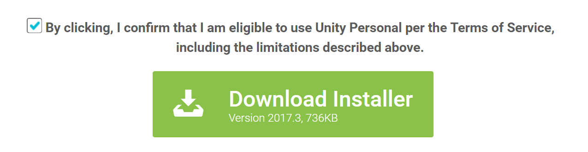
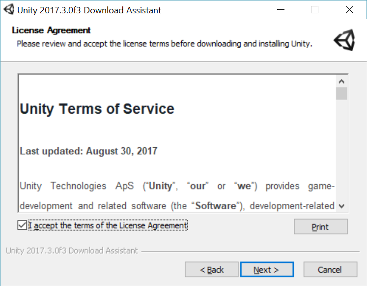
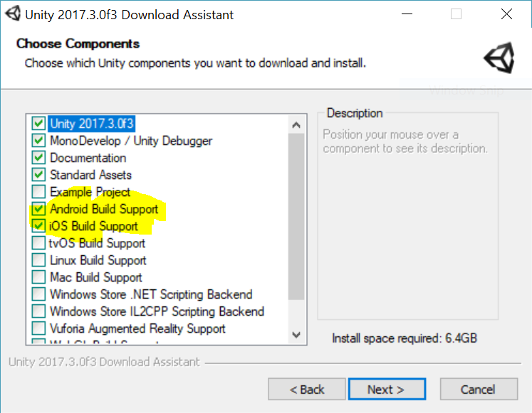

<h1>Installation</h1>
<h2>Downloading Unity and installing</h2>

In this tutorial we will be installing Unity and setting up our project directory

<h3>Installation Steps:</h3>
<ol>
    <li>Download Unity using <a href="https://unity3d.com/get-unity/download">this link</a></li>
    <li>Click "Choose your unity" </li>
    <li>Go to "Personal" </li>
    <li>Click Download </li>
    <li>Open the installer </li>
    <li>Make sure to tick the "Android/iOS build support" </li>
    <li>Install</li>
</ol>