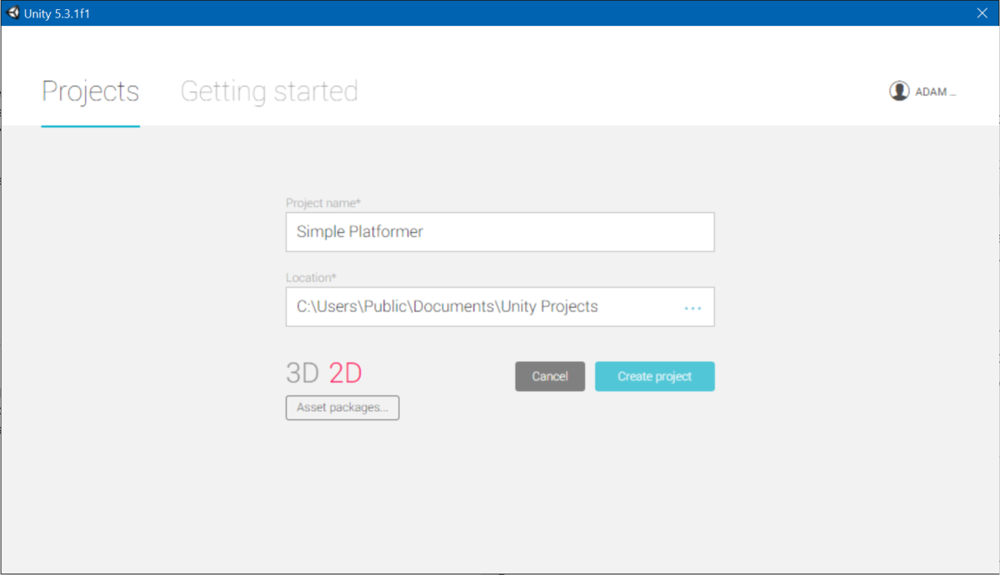
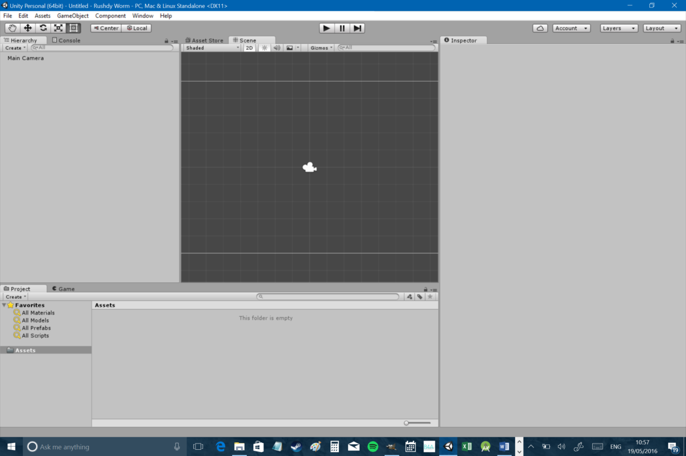
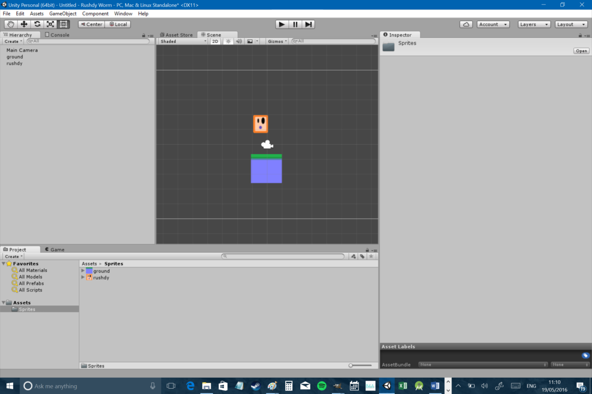
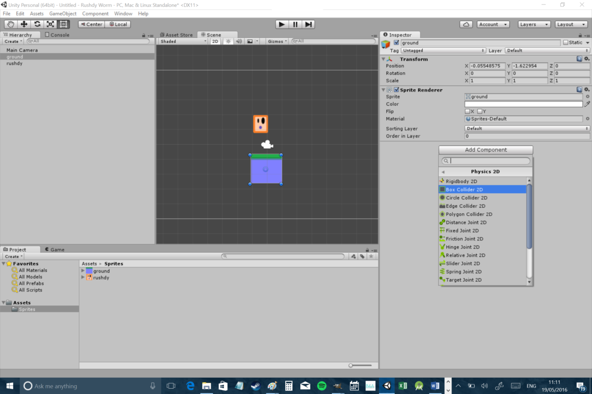
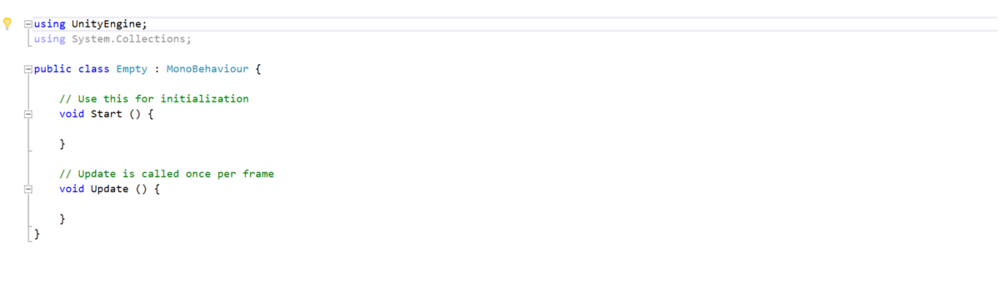
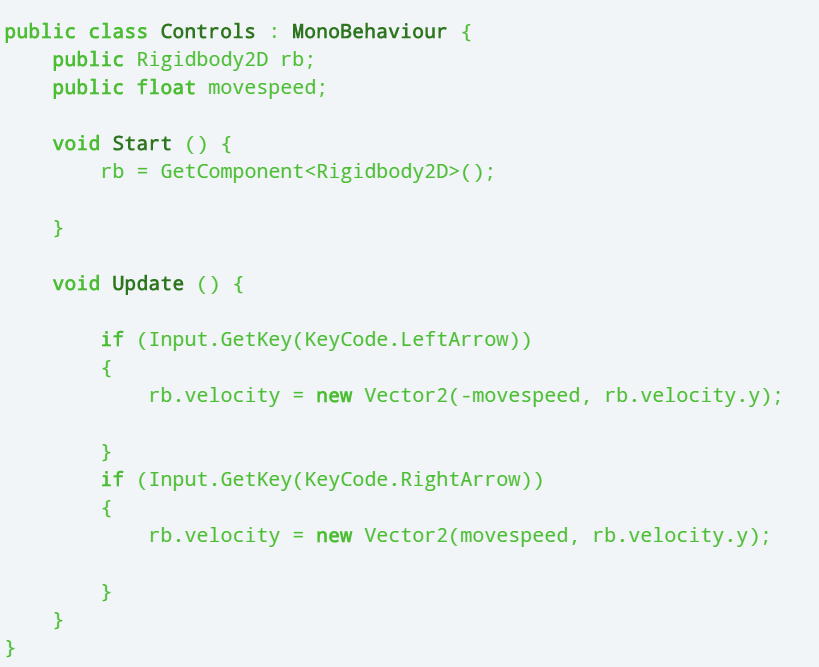
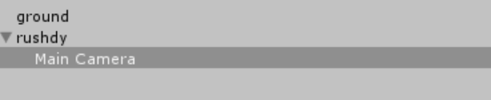
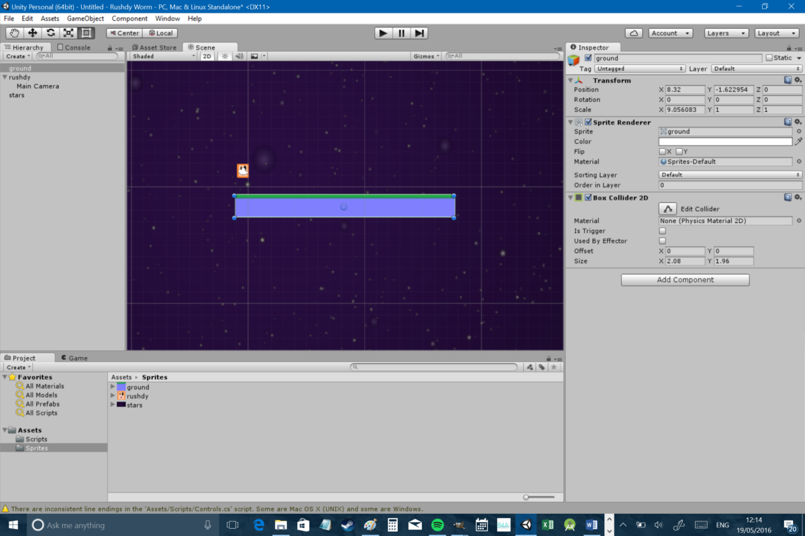

<h1>Lesson 1</h1>
<h2>Downloading Sprites and Creating the Project</h2>

In this tutorial we will be creating the first part of our game.

<a href="./Lesson-1-Sprites.zip" download="Lesson-1-Sprites.zip">Click here to download the sprites</a>
<h3>Steps:</h3>
<ol>
    <li>Open Unity and create a new project. It is important to select "2D" when creating your game.  </li>
<li>Your windows might be arranged slightly differently but you should always have the same selection to start with. The first
    thing you’re going to need is the ‘Project’ pane which is down the bottom for me. This is where you can see all the folders
    containing your various files. Select the ‘Assets’ folder and it will open to the right. Now right click in that folder
    and select ‘Create &gt; Folder’. You’re going to call this new folder ‘Sprites’. This will contain all of our sprites.
     
    
     
 Once you’ve created your ‘Sprites’ folder, you can simply drag and drop sprites you downloaded there from your file explorer. It’s then
a matter of dragging them into your ‘Scene’ pane at which point they become part of the game. This is where you can arrange
all your individual elements in a level. You can also drag things around the screen or scroll the page by holding ‘alt’ and
dragging. Pinch or use your scroll wheel to zoom in and out. Essentially a ‘scene’ is a level, though in future it might
also be a menu page or another screen in the game. You can also use the ‘Game’ view in order to see what your camera will
see at the starting point in the level.

</li>
<li>Now comes the part where you’re amazed at just how simple and easy Unity makes everything… First, click on your ground tile
    in the scene view. This will present you with some information in another window called the ‘Inspector’. This tells you
    the attributes pertaining to that particular game object (like the size and angle) and lets us tweak them to our heart’s
    desire.
     
 First, you need to choose ‘Add Component’ and then ‘Physics 2D &gt; Box Collider 2D’. This should create a thin green highlight
around your ground tile. This will set where the collision detection will begin and end for that object. If you had a more
detailed object then you could select ‘Edge Collider’, which would create a less uniform collider.
 
    
     
Now do the same thing for your player sprite. My player sprite is essentially a rectangle, which is going to make life nice
and easy for me. I also chose a sprite that faces forward so I can get away without animating him.
 
 At this point, our two
objects are now ‘solid’ as far as Unity is concerned but there’s no gravity. To change that, select your main character and
choose ‘Add Component’ and then ‘Rigidbody 2D’ which adds 2D physics to your given item. Click play and you’ll see the character
drop out of the air and land on the ground.
</li>
<li>Most games require some form of input to be fun, so let’s add some controls to our little character. To do this we’re going
    to try our first bit of code. Don’t worry, it’s pretty easy at this point. First, create a new folder in Assets and call
    it ‘Scripts’. Now in this directory, right click and select ‘Create &gt; C# Script’. Call it ‘Controls’ and then double
    click on it to launch Visual Studio for editing. You will be presented with a screen like this one:
     
    
         
 The basic bit of structure you’re presented with also makes things quite simple. Anything that happens inside Start will
deploy as soon as the related object gets created (for our purposes, this will be when the level/game starts). The Update
function meanwhile runs continuously and anything you put in here will happen continuously each time the scene refreshes.
 
In this case, you can use the code I’ve created to add very simple controls to your character:

 
Here we are creating a floating point variable called movespeed and making it public so that we can access it outside of
this script. We’re also creating a reference to the RigidBody2D that we added to our character and calling that rb. You’ll
be able to set the value for your public variables using the inspector for the game object to which the script is attached. 
In the ‘Start’ function, we tell Unity that rb is the RigidBody2D component attached to our game object. In ‘Update’ we’re
listening for the left arrow or right arrow input and then adding velocity to that rigidbody. Basically, we’re telling the
physics attached to our player that it now has some momentum heading either left or right.  Now all you need to do is to head
back to Unity and drag the ‘Controls’ script onto your player. This is something you’ll need to do a lot – and you’ll find
its very easy to forget! Don’t forget to change movespeed to ‘3’ in the inspector either (or whatever speed you like!). Now
when you hit play, you’ll be able to control the character left and right with the arrow keys. We’ll be adding touch input
later on.
</li>
<li>Now I’m going to make a few more small changes. First, I’m going to drag my platform from the left corner to the right to
    make it much wider. I purposefully designed a sprite here that wouldn’t look ‘stretched’ which will make designing levels
    nice and easy. You can also do this by selecting the resize tool along the top left of the interface, or by changing
    the scale in the Inspector.   Next, I’m going to take my camera in the left ‘hierarchy’ pane and drag it to drop
    it on my player game object (called ‘rushdy’ in my case). This makes the ‘Main Camera’ a ‘child’ of Rushdy (congratulations,
    it’s a baby camera!). Essentially, this means that the camera will now move when the character moves. I’ve also dropped
    my camera right into the center of the player by clicking on it in the scene view and then selecting the move tool in
    the top left. This now allows us to walk past the right of the screen without losing sight of the character.
     
    
     
    
</li>
</ol>